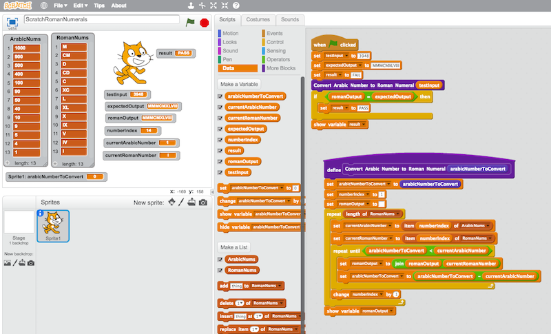
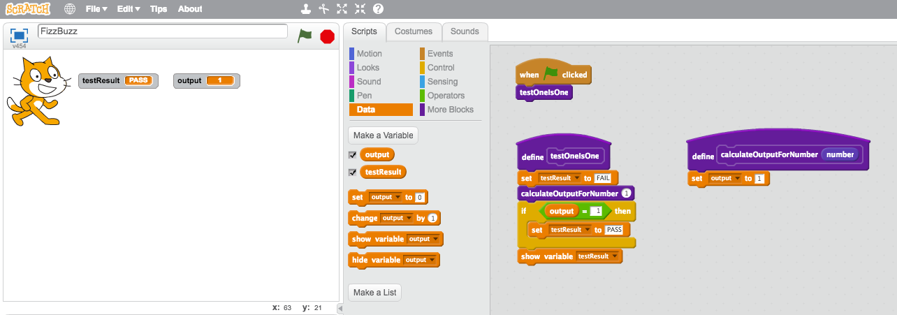
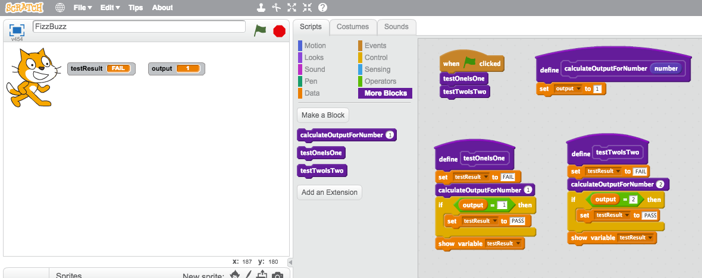
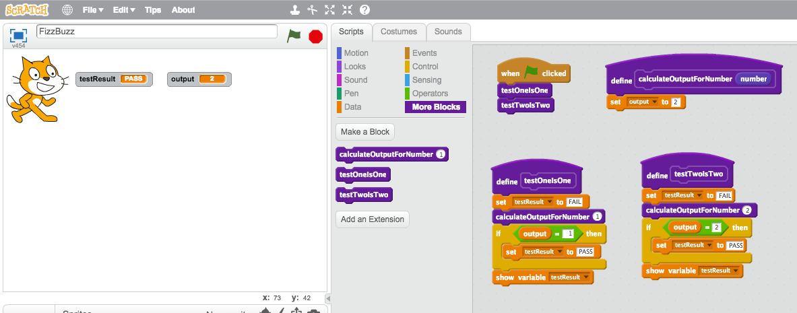
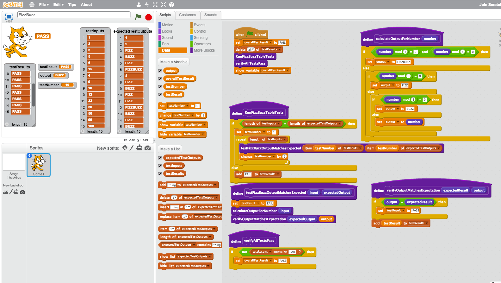
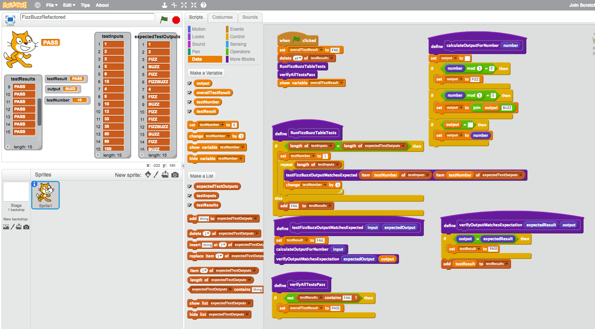

# ScratchTDD

Q: ScratchでTDDができますか？

A: はい、できますよ?

## 概要

私たちのチームでは、コードを書くときにテスト駆動開発（TDD）アプローチを使っています。私は、TDDとその多くのメリットの推進者です。ここでは、そのメリットについては触れません。[このテーマに関する記事はGoogleで検索すればたくさん出てきます]([https://www.google.co.jp/search?q=test%20driven%20development](https://www.google.co.jp/search?q=%E3%83%86%E3%82%B9%E3%83%88%E9%A7%86%E5%8B%95%E9%96%8B%E7%99%BA)) （他の検索エンジンでも検索可能です）。

[MITのScratch](https://scratch.mit.edu)は、基本的にビジュアルプログラミング環境で、「スクラッチは若い人たちが創造的に考え、体系的に推論し、協力して作業することを学ぶのを手助けします-プログラミングは21世紀の生活に不可欠なスキルです。」子供たちにコードを教えようという動きが広がっており、私たちの業界が抱えるスキルや多様性の不足を解決する上で重要な役割を果たすことが期待されています。

ある日、とんでもない考えが頭に浮かんできました。"はたしてScratchでTDDができるのか？"簡単にググってみましたが、ScratchでTDDを行った例は見つかりませんでした。

そこで、私の「10%の時間」を使って、ScratchでTDDを行うことを検討しました。最初の実験として、[ローマ数字カタ](http://codingdojo.org/kata/RomanNumerals/)のアルゴリズムを実装してみました。このとき、アルゴリズムを先に実装し、その後にテストを行うという少しズルをしています（これはTDDではありませんね！）。



これは少なくとも、自分のアルゴリズムのロジックを分離して、その周りにテストを行うことが可能であることを証明しました。そこで次に、Scratchで実際にTDDをやってみることにしました...。

_注：このレポジトリには、この投稿の様々なステージ/ソリューションのScratchファイルがあります。_

## TDDの基本

基本に戻って、まずテストを書き、それをパスするようにコードを書くことで、ScratchでTDDを行えることを証明することから始めましょう。TDDの基本は、_"Red -> Green -> Refactor"_ のフィードバックループをたどることです。


例えば名前を入力として受け取り、その名前を含む挨拶を出力する非常にシンプルな関数をTDDします。入力の例として

_"Hello, Ross. TDD は楽しいね?"_

を考えてみましょう。

まず最初に、空のテストを作成しましょう。これを"ブロック"としてつくります(ブロックとは他のプログラミング/スクリプト言語における関数やメソッドのようなものです)。

このブロックは、グローバル変数 `testResult` に "FAIL" をセットして表示しています。ちょっとスクラッチキャットが結果を言っているように見えるようにアレンジしてみました。


次に、実際に失敗するテストを書いてみましょう。testInputName を "Ross" とし、期待される挨拶は "Hello, Ross. TDD は楽しいね?"です。 そして、入力パラメータとして `name` を受け取る `Greeter` ブロック (今のところ空っぽ) を呼び出します。

期待した結果が得られなかったので、予想通り、テストは失敗しました。


さて、私たちがプログラムに求める振る舞いを記述した失敗するテストができたので、 `Greeter` でそのテストをパスさせるためのコードを書くことができます...。


ほらね これで `Greeter` 関数が正しい挨拶をすることを証明するテストに合格しました。

この段階でリファクタリング（全体的な挙動を変えずにコードを変更すること）を行い、コードを整理したり読みやすくしたりすることができます。

また、プログラムが異なる名前で動作することを確認するために、さらにいくつかのテストを書くこともできます。

しかし、"ScratchでTDDができるか？"という大前提を証明できたので、本題に移りましょう。

## FizzBuzz

### 本題

[FizzBuzzは一般的なコーディングの型](https://kata-log.rocks/fizz-buzz-kata)です。通常、次のような挙動を期待しています。

1から100までの数字を表示するプログラムを作成します。ただし、3の倍数の場合は数字の代わりに「Fizz」と表示し、5の倍数の場合は「Buzz」と表示します。3 と 5 の両方の倍数の場合は "FizzBuzz" と表示します。

例:
```
1
2
Fizz
4
Buzz
Fizz
7
8
Fizz
Buzz
11
Fizz
13
14
FizzBuzz
16
17
Fizz
19
Buzz
[... etc up to 100]
```

つまり
- ある数字が3で割り切れるなら "FIZZ "と言い
- 5で割り切れる数字なら "BUZZ"
- 3と5で割り切れる数なら "FIZZBUZZ"
- その他の数字については、その数字を言います。

TDDを使って問題を探り、各入力数に対して何を出力するかを決定する関数（「ブロック」）だけを書いてみましょう。

### 基本的なテストから始める

まずは単純な失敗するテスト `testOneIsOne` で、入力が `1` であれば出力は `1` であることをテストしてみましょう...。


`calculateOutputForNumber` ブロックから `1` を返すだけで、パスさせることができます。



`1` を返すだけでは FizzBuzz のすべての数字に対応できないので、別のテストシナリオを選んでそれに対する失敗テストを書き、アルゴリズムを構築することを検討し始める必要があります。

数字の `2` に対して失敗するテストを書いてみましょう。



そして、それをパスさせましょう...



しかし、あーあ、あきらかに問題がありますね。出力をただ `2` に変更することで、パスにしたのです。そして結果として `testResult` は "PASS" と表示されています。しかし、最初の `testOneIsOne` は失敗していますが2つ目のテスト `testTwoIsTwo` 結果"PASS"で単純に上書きされているだけですね。

そこで、それぞれのテスト結果がわかるようにテストコードを少しリファクタリングして、個々のテストの結果を `testResults` のリストに追加するようにしました。次に、`verifyAllTestsPass` というブロックがあり、全体的に失敗がないかどうかをチェックして、失敗がなければ `overallTestResult` に "PASS" をセットします。


これで、最初のテストが失敗していることと、テストスイート全体が失敗していることが正しく表示されるようになりました。それでは、コードを修正しましょう。

とりあえず入力の `number` を `output` に設定してみましょう...。


次に、`3`の入力が "FIZZ "を返すかどうかをチェックするテストを追加してみましょう。これは、私たちのアルゴリズムをもう少しちゃんと組むことを必要とします。ここでは、一旦単純に数字が `3` かどうかをチェックして、 `3` ならば `output` を "FIZZ" に、そうでなければ `number` を入力に設定することにしましょう。


もちろんそれがダメなのは分かっていますよね。本来は`3`で割り切れるすべての数は "FIZZ"と言うべきでしょう。`6` のテストを追加して、数字を `3`で割って余りが`0`になったときに "FIZZ" と言うようにコードを変更しましょう。これには [modulo 演算子]([https://en.wikipedia.org/wiki/Modulo_operation](https://ja.wikipedia.org/wiki/%E5%89%B0%E4%BD%99%E6%BC%94%E7%AE%97)) を使います。余りが`0`であることをチェックすることで入力された数字が`3`で割り切れることを事実上教えてくれるものです。


### リファクタリング

これまで、私たちはひたすらテストとコードを書き続けてリファクタリングすることを避けてきました。しかし、私たちのテストは少し無駄に繰り返しになり始めています。同じように見えて、同じことをしていて、しかし異なる入力と異なる期待値を持っています。リファクタリングしましょう。

#### 記述ブロック（機能/メソッド）を抽出する

まず、テスト検証を説明的な名前を持つブロックに抽出したいと思います。


今、その認証コードは1つの場所にしか存在せず、それを_再利用_することができるのです。

でも、私たちのテストは、まだ少し繰り返しが多いようです...。

#### 表形式テスト

これは「表形式テスト」（パラメータ化テストとも呼ばれる）を使うのが良さそうですね。簡単に言うと、入力値と期待される出力値の表が欲しいのです。

私はこれをScratchで `testInputs` と `expectedTestOutputs` という2つの_list_を使って実装してみました。

テストコードをリファクタリングして、今は `RunFizzBuzzTableTests` というのがあります。

1. 入力数と期待される出力数が一致することを確認する。
2. 入力リストを繰り返し処理する。
3. 各テスト入力に対して `testFizzBuzzOutputMatchesExpected` を実行する。このブロックは出力を計算し、それが期待される出力と一致するかどうかを検証するために個々のテストを行う。


### Buzzin'

これで、テストの入力と期待される出力のペアをテストリストに追加するだけで、簡単にテストを追加できるようになりました。

`5` が "BUZZ" であるかどうかのテストを追加してみましょう。最初は失敗します。


そして、5で割り切れる数に対して「BUZZ」と正しく出力するように、アルゴリズムを修正しましょう...。


### FizzBuzz!

主要なシナリオはほぼ網羅しました。"FIZZBUZZ "はどうでしょうか。

テーブルにテストケースを追加して、それをパスさせるだけです...。


シナリオを増やしたらどうでしょう？数字と予想される結果をたくさん入れてみましょう。

私たちは、テストケースにおいて、文字通りありとあらゆる入力と出力をテストするような、_徹底的_なことはしません。いつ、どのようなテストを行うべきかは、ここでは触れません。今のところ、私たちのアルゴリズムが機能するという確信を得るために、十分なカバレッジを与えるシナリオの束を置くだけです。



スクラッチキャットが「PASS」と言いました!

### 安全なリファクタリング

よくテストされたコードベースを持つことで得られる素晴らしいことの1つは、安全にリファクタリングができることです。アルゴリズムの内部を変更しても、入力と期待される出力の観点からその挙動を壊していないことを検証できるテストスイートがあることが分かっているからです。

それを試してみましょう。今のところ、アルゴリズムは3つのネストしたif-else条件ブロックから構成されています。もっとシンプルなものに変えてみましょう。

その代わり、次のようにします。

1. `output` を空の文字列として開始する。
2. もし `number` が 3 で割り切れるなら、`output` に "FIZZ" を追加する。
3. 次に、もし `number` が 5 で割り切れるなら、`output` に "BUZZ" を追加する。これで、「数」が3で割り切れる場合と5で割り切れる場合について、自動的に「FIZZBUZZ」が出力されるはずである。
4. 最後に、もし `output` の文字列がまだ空であれば、それを入力 `number` にセットする。

変更を加えてから、テストスイートを再実行し、まだ動作することを確認することができます。



スクラッチキャットが「PASS」と言いました!

そう、これです。私たちはFizzBuzzのコアアルゴリズムを、Scratchで、テスト駆動開発アプローチを使って実装しました。できるのです。

## ローマ数字例の再考

ScratchでTDDができることを証明した後、私はローマ数字の例に戻ることにしました。アルゴリズムは既に持っていたのですが、それが動作することを確認するために、一連の表形式のテストを巻き付けることにしました。

FizzBuzzでやったことのほとんどを繰り返し、テストデータは[以前Kotlinでこの型を実装した例](https://github.com/rossharper/RomanNumerals-Kotlin)からコピーしました。


## 次のステップ

この時点で、これ以上検討する時間がなくなってしまいました。Scratchでプログラムコードとテストコードを分離し、TDDを行うインターフェイスを持つ方法について考えてみましょう。
例えば、アラビア数字を入力し、スクラッチキャットにローマ数字を言わせ、テストスイートを実行するためのボタンを別に用意してみましょう。

でも、そこに置いておこうと思う。面白いチャレンジでした。でも、まとめると...

ScratchでTDDは可能ですか？はい、できます。
