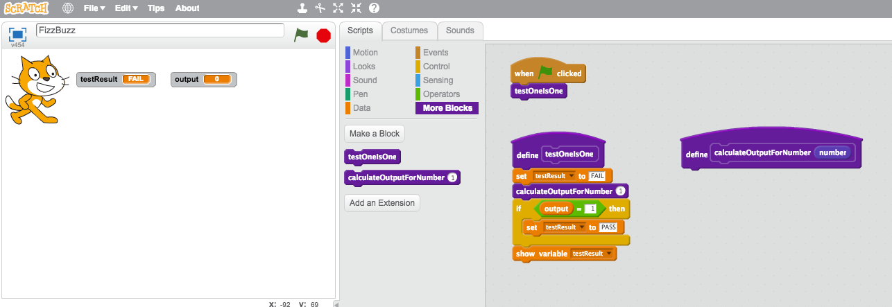
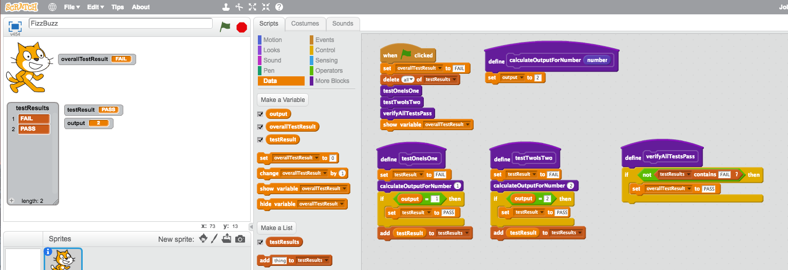
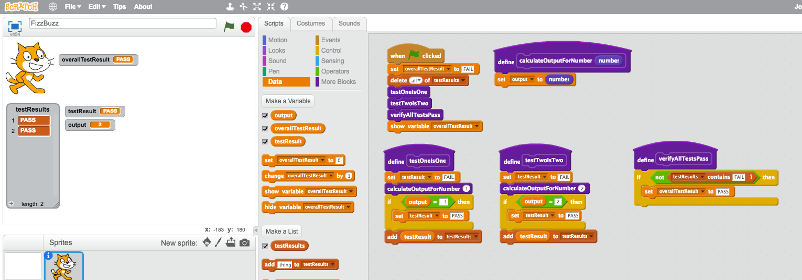
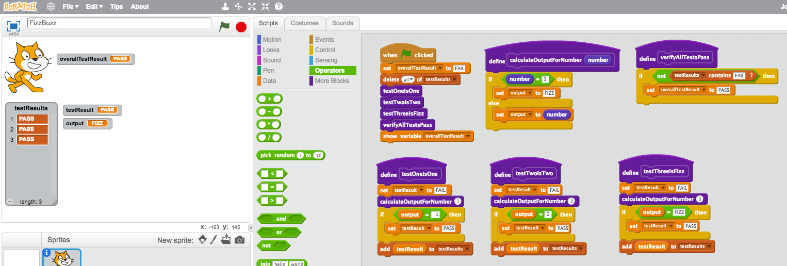
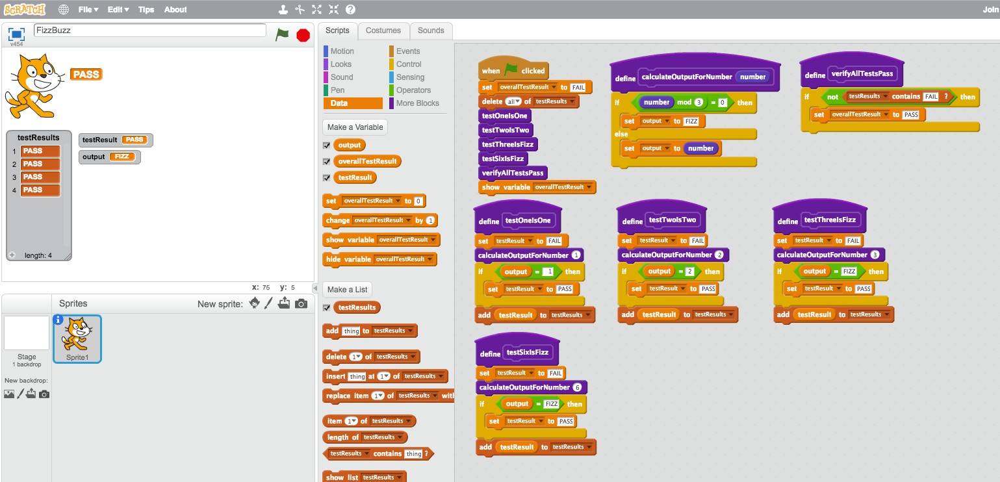
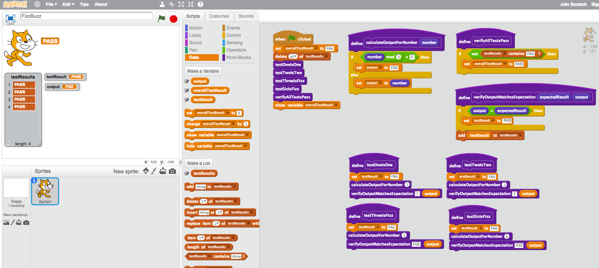
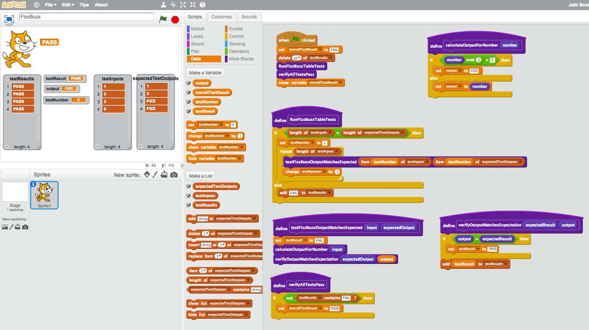
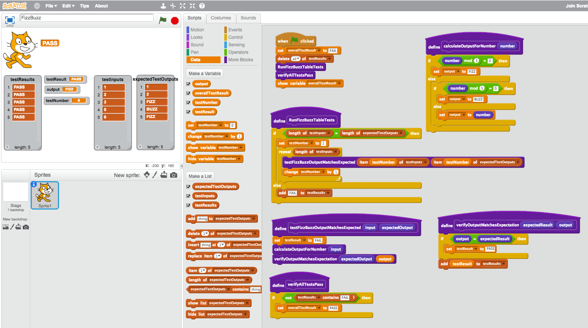
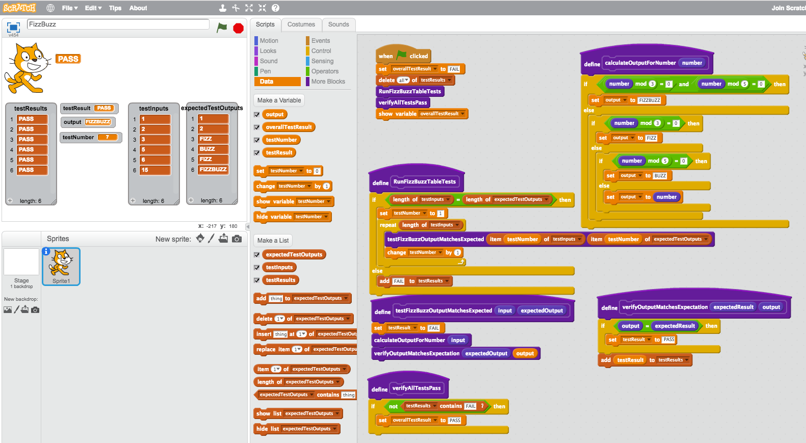

# ScratchTDD

Can you TDD in Scratch?

## Overview

In our team, we use a Test-Driven Development (TDD) approach when writing code. I'm a supporter of this approach and its many benefits. I won't go into the benefits here — you can [Google](https://www.google.co.uk/search?q=test%20driven%20development) many articles on the subject (other search providers are available).

[Scratch](https://scratch.mit.edu), from MIT, is essentially a visual programming environment that _"helps young people learn to think creatively, reason systematically, and work collaboratively — essential skills for life in the 21st century"_. There's a growing movement around teaching kids to code, that will hopefully play an important part in solving the skills and diversity shortages our industry has.

One day, the crazy thought popped into my head: _"Can you TDD in Scratch?"_. I did a brief Google, and couldn't find any examples of TDD in Scratch.

So, in my "10% time", I looked into doing the [Roman Numerals Kata](http://codingdojo.org/kata/RomanNumerals/) in Scratch. On my first attempt, I cheated a little and implemented the algorithm first and then put a test around it (this _isn't_ TDD).

This at least proved that it is possible to separate my algorithm logic and have tests around it. So next I decided to do some actual TDD in Scratch...

## Basic TDD

# FizzBuzz

## The problem

_TODO_

## Start with some basic tests

## Refactor

## Buzzin'

## FizzBuzz!

